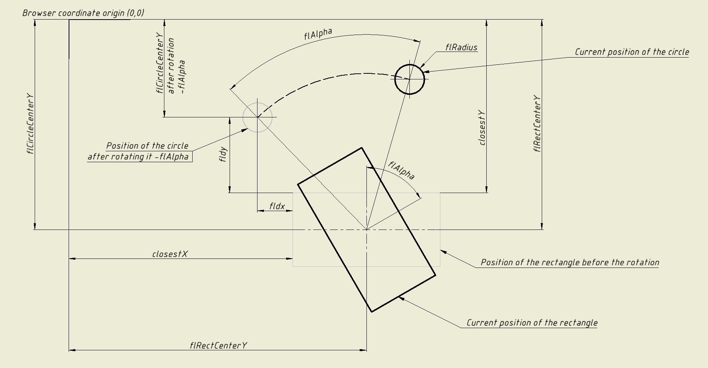

#  Circle-Square Collision Detection

A standalone JavaScript function that detects collisions between a **circle** and a (possibly rotated) **rectangle**.

This function works purely with **standard DOM elements and math** — no canvas, no libraries required.
[](https://sokolovskyik.github.io/circle-square-collision/)

---

##  Features

-  Supports both rotated and unrotated rectangles
-  Uses reverse-rotation math for clean detection — by rotating the circle back (*mathematically*, not visually) instead of the rectangle
-  Automatically extracts the rotation angle from CSS transforms (if not manually specified)
-  Reports which edges were touched (top, bottom, left, right)

---

##  Visual Explanation

This diagram illustrates the logic behind `circleRectCollision`.

The rectangle may be rotated, so the circle is **reverse-rotated** by `-flAlpha` (*again, mathematically*) to simulate detection against an **axis-aligned rectangle**.



- The **dashed arc** shows the circle’s reverse rotation around the rectangle’s center.
- The **gray rectangle** represents the unrotated version of the same rectangle — shown for illustration purposes only.
- After the circle is reverse-rotated, all further calculations become simple — as if the rectangle had never been rotated and everything were aligned to the browser’s original coordinate system.
- Edge detection is based on comparing the rotated circle’s center to the `closestX` / `closestY` values on the rectangle’s sides.

---

##  Usage

```js
checkCircleRectangleCollision(circleElement, rectangleElement, optionalRotationAngle)

const circle = document.getElementById('circle');
const rectangle = document.getElementById('rectangle');

// Passing an angle is optional — if omitted, it will be automatically calculated from the CSS transform
const result = checkCircleRectangleCollision(circle, rectangle, 45);


console.log(result);

// Return Value

/*The function returns either:

    //false — if no collision is detected

    An object — if a collision is detected:*/

// Example output:
{
  collision: true,     // Always present when a collision occurs
  edge: true,          // Present only if the circle touches the rectangle's edge
  top: true,           // Present if the top edge is touched
  bottom: true,        // Present if the bottom edge is touched
  left: true,          // Present if the left edge is touched
  right: true          // Present if the right edge is touched
}